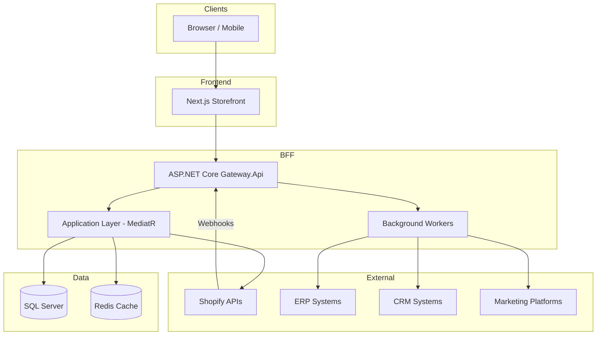
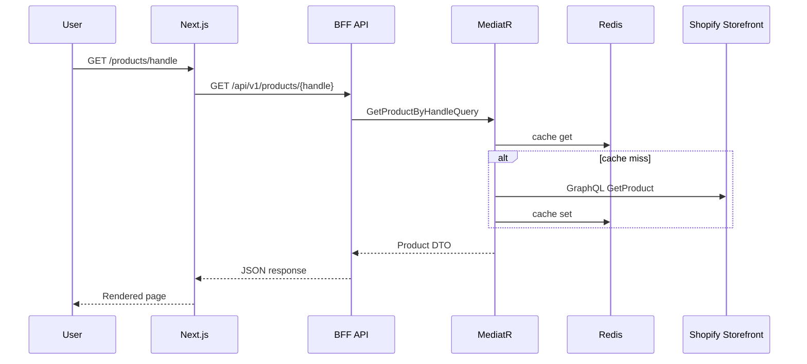

# Architecture Overview

Enterprise headless commerce platform with **Clean Architecture**, **DDD**, and **CQRS**.

## System Context

## Layer Responsibilities

| Layer | Project | Responsibility |
|-------|---------|----------------|
| Presentation | `Gateway.Api` | HTTP, auth, webhooks, health, Swagger |
| Application | `Application` | CQRS use-cases, validation, orchestration |
| Domain | `Domain` | Entities, value objects, domain events |
| Infrastructure | `Infrastructure` | Cache, logging, DI wiring |
| Persistence | `Persistence` | EF Core, repositories, unit of work |
| Integrations | `Integrations/*` | Shopify, ERP, CRM, Marketing adapters |
| Workers | `Workers` | Background sync + webhook processing |

## Request Flow (Product Detail)

## Multi-Store Support

- `StoreId` column on domain entities enables per-store data isolation
- Shopify settings can be extended to a multi-tenant configuration provider
- Future decomposition: extract `Integrations.Shopify` and `Workers` into separate services

## Microservice Migration Path

1. **Phase 1 (current):** Modular monolith with clear bounded contexts
2. **Phase 2:** Extract webhook processor + workers to dedicated worker service
3. **Phase 3:** Extract ERP/CRM/Marketing integrations as independent services
4. **Phase 4:** Event bus (Azure Service Bus / RabbitMQ) replaces in-memory queue
