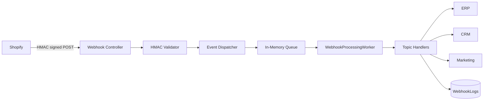

# Webhooks

## Supported Topics

| Topic | Handler | Action |
|-------|---------|--------|
| `orders/create` | `OrderCreatedWebhookHandler` | ERP export + marketing event |
| `orders/paid` | `OrdersPaidWebhookHandler` | Payment confirmation |
| `orders/updated` | `OrdersUpdatedWebhookHandler` | Order sync |
| `products/create` | `ProductCreateWebhookHandler` | Catalog sync |
| `products/update` | `ProductUpdateWebhookHandler` | Catalog sync |
| `customers/create` | `CustomerCreateWebhookHandler` | CRM export |
| `refunds/create` | `RefundCreateWebhookHandler` | Refund processing |

## Architecture



## Security

1. HMAC-SHA256 validation via `X-Shopify-Hmac-Sha256` header
2. Constant-time comparison to prevent timing attacks
3. Invalid signatures return `401 Unauthorized`

## Endpoint

```
POST /api/v1/webhooks/shopify
```

## Retry & Dead Letter

- `WebhookLog` tracks processing status and retry count
- After 5 failures → `DeadLetter` status
- Production: replace in-memory queue with Redis Streams or Azure Service Bus

## Registration (Shopify Admin)

Configure webhook URL in Shopify Admin or via Admin API:

```
https://your-bff-domain.com/api/v1/webhooks/shopify
```
