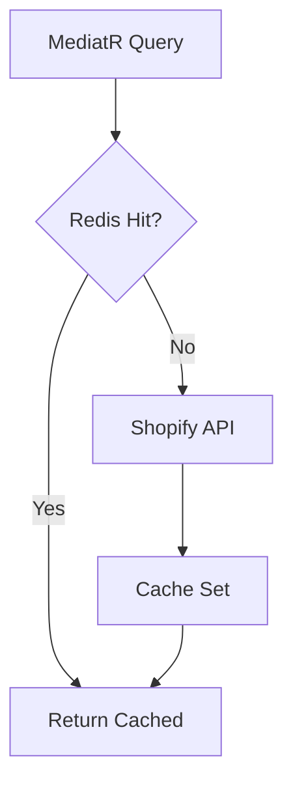

# Caching Strategy

## Redis via `ICacheService`

```csharp
Task<T?> GetAsync<T>(string key);
Task SetAsync<T>(string key, T value, TimeSpan? expiry);
Task RemoveAsync(string key);
Task RemoveByPatternAsync(string pattern);
```

## Cache Keys

| Resource | Key Pattern | TTL |
|----------|-------------|-----|
| Product | `product:{handle}` | 10 min |
| Product list | `products:page:{page}` | 5 min |
| Collections | `collections:all` | 15 min |
| Cart | `cart:{id}` | 24 hours |
| Customer | `customer:{id}` | 10 min |
| Search | `search:{query}:{page}` | 5 min |

## Invalidation

- Product webhooks (`products/update`) should invalidate `product:{handle}` and list caches
- Cart mutations always write-through to cache
- Pattern-based invalidation requires Redis SCAN (extend `RedisCacheService` with `IConnectionMultiplexer`)

## Architecture



## Configuration

```env
REDIS_CONNECTION=redis:6379
```

Docker Compose includes Redis 7 with health checks.
