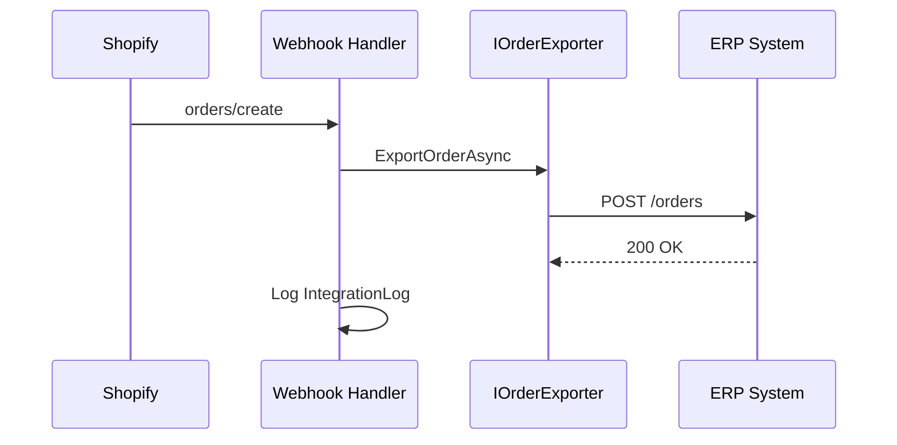

# ERP Integration

## Abstraction Layer

```csharp
IERPClient          // Health check, provider identity
IOrderExporter      // Export Shopify orders to ERP
IProductImporter    // Import products from ERP
IInventorySynchronizer  // Sync stock levels
```

## Supported Adapters (Stubs)

| Provider | Class | Capabilities |
|----------|-------|-------------|
| Nebim | `NebimErpClient` | Order export, product import, inventory sync |
| SAP | `SapErpClient` | Order export |
| Logo | `LogoErpClient` | Order export |
| Mikro | `MikroErpClient` | Order export |

## Configuration

```env
ERP_PROVIDER=Nebim
ERP_BASE_URL=https://erp.example.com/api
ERP_API_KEY=
```

## Order Export Flow



## Extending

1. Implement `IERPClient` + required interfaces in `Integrations/ERP/Adapters/`
2. Register in `Integrations/ERP/DependencyInjection.cs`
3. Wire real HTTP calls replacing `TODO` stubs

## Background Sync

- `OrderSyncWorker` — polls pending sync jobs
- `InventorySyncWorker` — periodic ERP → Shopify inventory sync
- `ProductSyncWorker` — Admin API product sync
