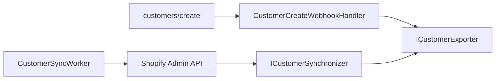

# CRM Integration

## Abstraction Layer

```csharp
ICustomerExporter     // Push customer to CRM
ICustomerSynchronizer // Bidirectional sync
IEventPublisher       // Publish CRM events
```

## Supported Adapters (Stubs)

| Provider | Class |
|----------|-------|
| Hubspot | `HubspotCrmClient` |
| Salesforce | `SalesforceCrmClient` |
| Insider | `InsiderCrmClient` |

## Configuration

```env
CRM_PROVIDER=Hubspot
CRM_BASE_URL=
CRM_API_KEY=
```

## Event Flow



## Customer Sync Worker

Runs every 15 minutes:
1. Fetches customers from Shopify Admin API
2. Syncs each to configured CRM provider
3. Logs results in `IntegrationLogs` table

## Marketing Overlap

CRM event publishing (`IEventPublisher`) complements the Marketing module — use CRM for customer lifecycle and Marketing for campaign/analytics events.
